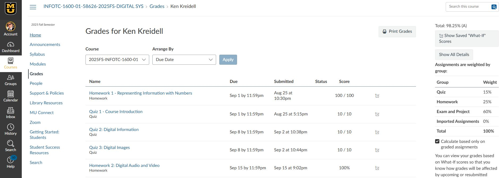

- [Home](README.md) - [Getting Started](canvas_getting_started.md)  - [Navigating Courses](canvas_course_nav.md)  - [Submitting Assignments](canvas_submit_assignments.md)  - [Checking Grades](canvas_check_grades.md)  - [Communicating with Instructors](canvas_instructor_communication.md)
# Checking Grades

## How to View Grades
1. From the any Course Homepage, click **Grades** in the lefthand **Course Nav Menu**.
    

---

## Gradebook Features
- **Total Grade:** Shows your current standing in the course.
- **Assignment Details:** Click on an assignment to see comments and rubric scores.
- **What-If Grades:** Use this feature to estimate your grade if you score differently on future assignments.

---

## Notes
- Grades may take time to appear after submission.
- Use feedback to improve future work.
- Contact your instructor if something looks incorrect.
