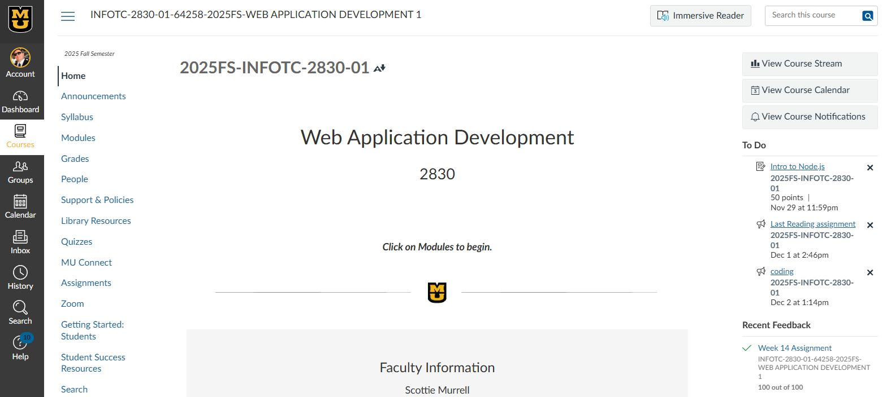

- [Home](README.md) - [Getting Started](canvas_getting_started.md)  - [Navigating Courses](canvas_course_nav.md)  - [Submitting Assignments](canvas_submit_assignments.md)  - [Checking Grades](canvas_check_grades.md)  - [Communicating with Instructors](canvas_instructor_communication.md)
# Navigating Canvas Courses
Open a Course Homepage by clicking the **Course Card** on the **Dashboard** or clicking **Courses** → **Course Link** from the sidebar.

## Course Homepage
Each course has a homepage with announcements, modules, and links. Look for the **Modules** section to find weekly readings, lectures, and assignments.  The **Course Nav Menu** on the left gives immediate access to various course features.

---

## Key Features of Course Nav Manu (classes may not have all features)
- **Announcements:** Updates from your instructor.
- **Syllabus:** Course outline and policies.
- **Modules:** Organized learning materials.
- **Grades:** Review grades - may also submit assignments launch quizzes.
- **Assignments:** All homework and projects.
- **Quizzes:** Online tests and practice quizzes.
- **Discussions:** Forums for class participation.

Some classes have additional features in teh  in course nav bar

---

## Tips
- Bookmark your most-used courses for quick access.
- Check the **To-Do List** on the right side of the Dashboard for upcoming deadlines.
