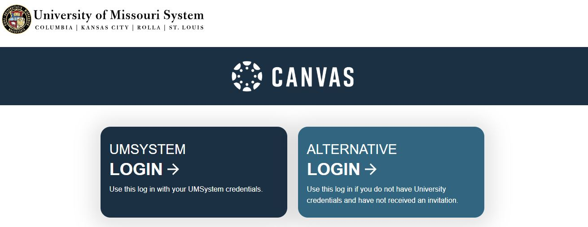
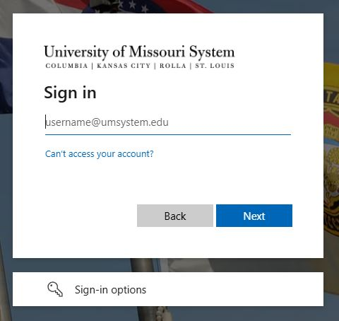
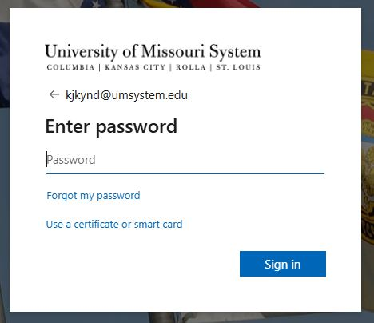
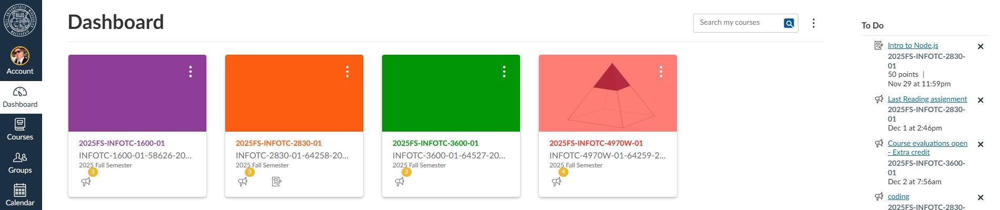

- [Home](README.md) - [Getting Started](canvas_getting_started.md)  - [Navigating Courses](canvas_course_nav.md)  - [Submitting Assignments](canvas_submit_assignments.md)  - [Checking Grades](canvas_check_grades.md)  - [Communicating with Instructors](canvas_instructor_communication.md)  

# Getting Started with Canvas

## Logging In
1. Go to Mozzou’s Canvas login page: [Mizzou Canvas](https://umsystem.instructure.com/)

    

2. Click **UMSYSTEM Log In**.
   
3. Enter your Mizzou student credentials (pawprint username - like kjkabc@umsystem.edu) and click **Next**.

    

4. Enter the password for your Mizzou credentials and click **Sign In**.

    

---

## Dashboard Overview
- The **Dashboard** (default page) shows all your active courses.
- Each course card links directly to that class.

    

- Use the sidebar for quick access to:
  - **Account** (profile and settings)
  - **Dashboard** (course cards, To Do list, & feedback)
  - **Courses** (shortcut links to active course with option to view all courses)
  - **Groups** (class/student groups & teams)
  - **Calendar** (deadlines and events)
  - **Inbox** (messages)
  - **History** (previous activity)
  - **Search** (find specific course content)
  - **Help** (help for Canvas, not course content)

---

## Personalizing Your Account
- Click **Account** → **Profile** to add a picture or bio.
- Adjust **Notifications** to control email alerts for assignments, grades, and announcements.

---
