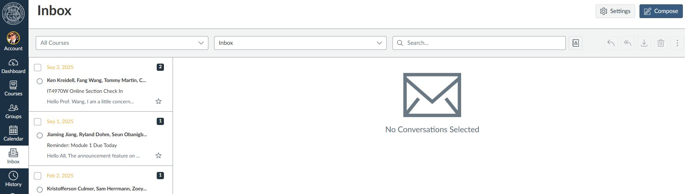
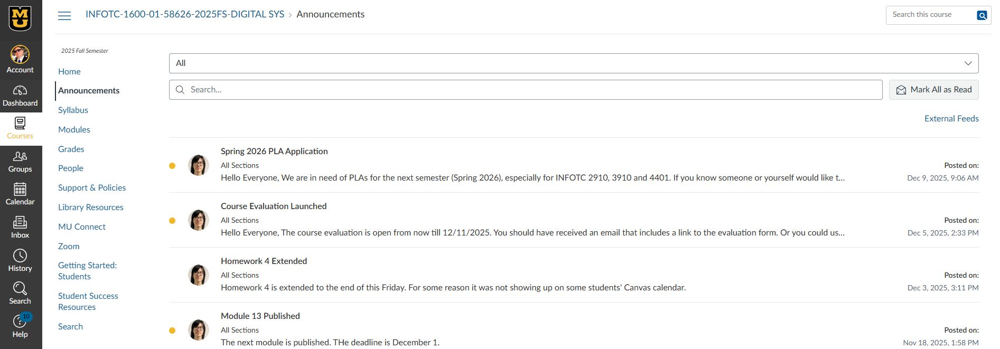
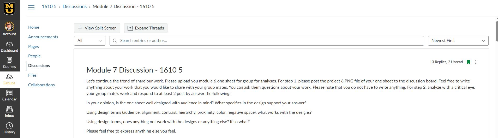

- [Home](README.md) - [Getting Started](canvas_getting_started.md)  - [Navigating Courses](canvas_course_nav.md)  - [Submitting Assignments](canvas_submit_assignments.md)  - [Checking Grades](canvas_check_grades.md)  - [Communicating with Instructors](canvas_instructor_communication.md)
# Communicating with Instructors

## Canvas Inbox
- Use the **Inbox** to send messages to instructors and classmates.
- Messages work like email but stay within Canvas.
- You can attach files or include links.
    
---

## Announcements
- Check announcements regularly for updates.
- Instructors often post reminders about deadlines or changes to the syllabus.
    
---

## Discussion Boards
- Participate in discussions to engage with peers and instructors.
- Follow netiquette: be respectful, clear, and professional.
    
---

## Tips
- Enable notifications so you don’t miss messages.
- Keep communication professional — Canvas messages are part of your academic record.
