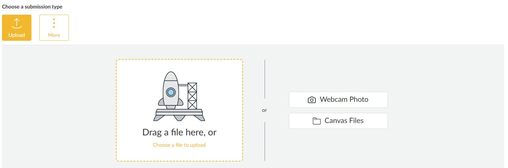
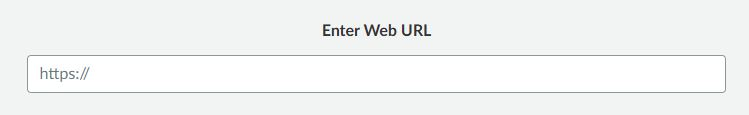

- [Home](README.md) - [Getting Started](canvas_getting_started.md)  - [Navigating Courses](canvas_course_nav.md)  - [Submitting Assignments](canvas_submit_assignments.md)  - [Checking Grades](canvas_check_grades.md)  - [Communicating with Instructors](canvas_instructor_communication.md)
# Submitting Assignments

## Steps 
1. Open the course and go to **Assignments** OR **Grades**.
   
    
    
2. Select the assignment you wish to submit.
3. Review assignment details
4. Scroll to bottom of Assignment page
5. Upload your file or paste text as required.
6. Click **Submit Assignment**.

---

## File Upload Options
- **File Upload:** Attach documents (PDF, DOCX, etc.).
    
- **Text Entry:** Type directly into Canvas.
- **Website URL:** Paste a link if required.
    
- **Media Recording:** Record audio or video submissions.

---

## Tips
- Double-check file formats (PDF, DOCX, etc.).
- Look for confirmation that your submission was successful.
- Resubmit if your instructor allows multiple attempts.
